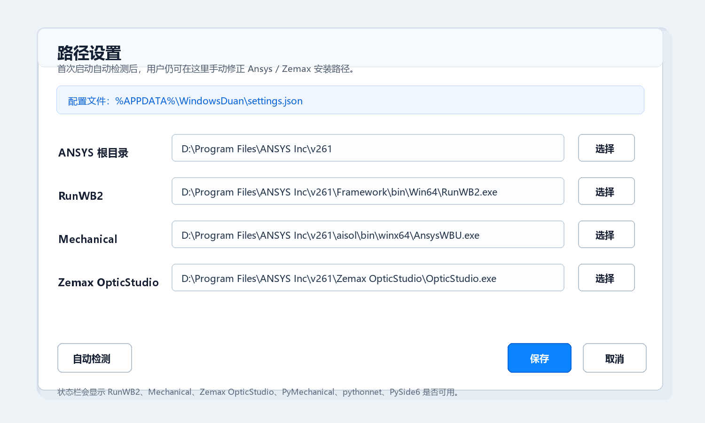
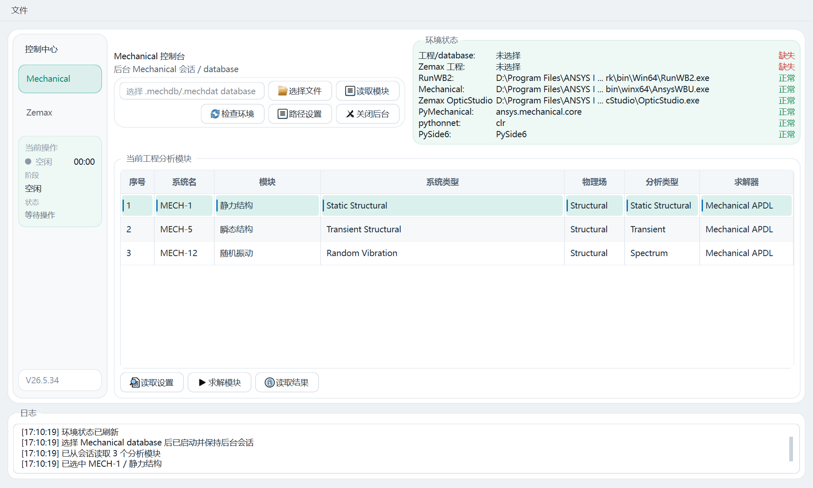
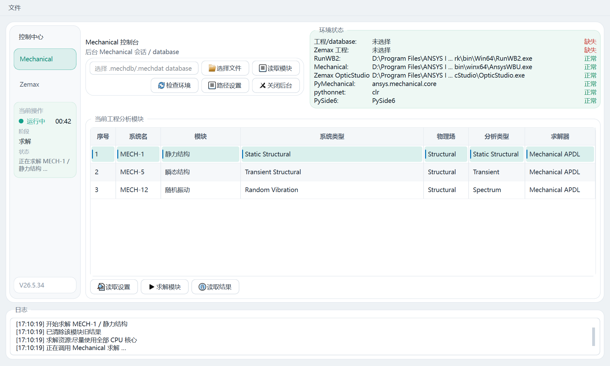
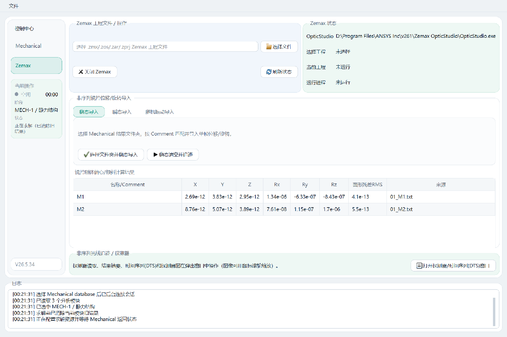
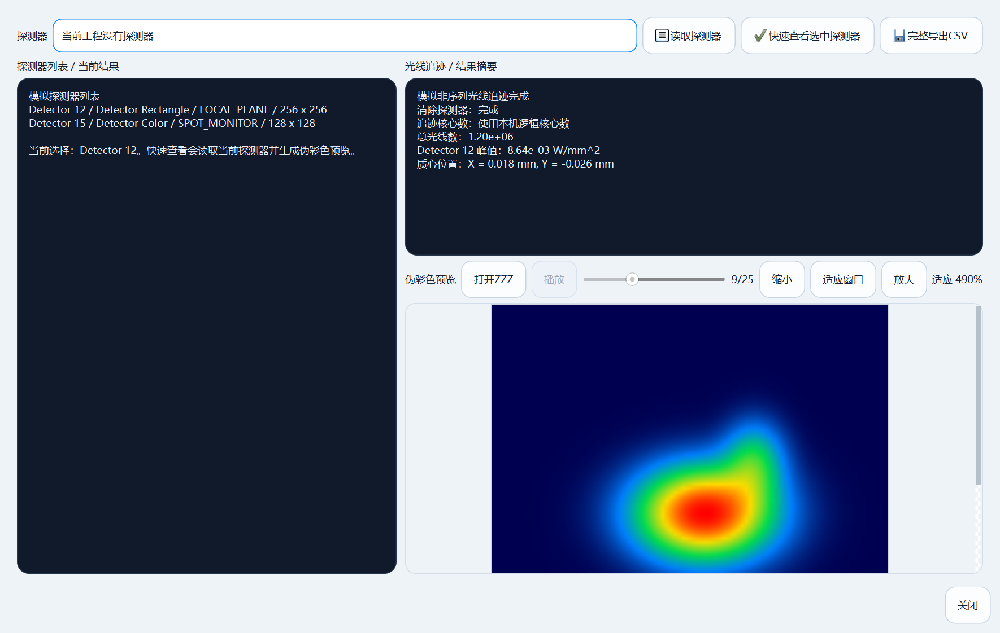

# ansys-mechanical-zemax联合仿真程序 软件说明

> 版本 V26.5.34。本软件是 Ansys Mechanical 与 Zemax OpticStudio 的本机联合仿真自动化控制端，用于把「结构/热 → 光学（STOP）」联合分析整合到一个桌面界面中完成。

---

## 1. 软件定位

`ansys-mechanical-zemax联合仿真程序` 把一条原本要在两套软件、多个脚本、多个文件夹之间反复手工切换的联合分析流程，整合到同一个桌面界面里：在 Mechanical 中求解并导出镜片节点位移，由本软件计算每个镜片的整体刚体位移/旋转，按名称写入 Zemax 非序列工程，执行光线追迹并读取探测器光斑结果。

软件**不替代求解器**：有限元解算仍由 Ansys Mechanical 完成，光线追迹仍由 Zemax OpticStudio 完成。本软件的职责是本地自动化控制——后台启动并保持会话、读写设置、触发求解、读取与导出结果、把节点位移换算成镜片刚体位移/旋转、按名称写入 Zemax、运行追迹、读取探测器数据，并把关键状态显示在统一界面中。

连接方式：

| 软件 | 连接技术 | 是否打开图形界面 |
|------|----------|------------------|
| Ansys Mechanical | PyMechanical（`ansys-mechanical-core`） | 后台会话，不弹 Mechanical 窗口 |
| Zemax OpticStudio | ZOS-API（pythonnet 调用 .NET） | 后台会话，不弹 OpticStudio 窗口 |

当前主流程基于 Mechanical database 文件（`.mechdb` / `.mechdat`）。选定 database 后，软件以后台方式启动并保持 Mechanical 会话，并在该会话中读取分析模块、读取设置、求解、读取与导出结果。旧版 Workbench 工程（`.wbpj` / `.wbpz`）脚本仍保留在 `scripts/` 下作为兼容工具，但桌面主流程已转向 database 文件，以减少工程锁与中间文件带来的不稳定。

---

## 2. 运行环境与依赖

目标机器必须已经安装并授权 **Ansys Mechanical**（含 PyMechanical 接口）和 **Zemax OpticStudio**（含 ZOS-API 组件）。安装包**不分发** Ansys、Zemax 及其许可证。

软件第一次启动时会自动扫描常见安装位置（`C:\Program Files\ANSYS Inc\v*`、`D:\Program Files\ANSYS Inc\v*` 及常见 OpticStudio 目录），识别四个关键路径并保存到 `%APPDATA%\WindowsDuan\settings.json`：

| 项 | 默认推断位置（以 v261 为例） |
|----|------------------------------|
| ANSYS 根目录 | `D:\Program Files\ANSYS Inc\v261` |
| `RunWB2.exe` | `…\v261\Framework\bin\Win64\RunWB2.exe` |
| `AnsysWBU.exe`（Mechanical） | `…\v261\aisol\bin\winx64\AnsysWBU.exe` |
| `OpticStudio.exe` | `…\v261\Zemax OpticStudio\OpticStudio.exe` |

路径优先级为 **环境变量 > 用户配置文件 > 自动检测**。设置了 `ANSYS_ROOT`、`ANSYS_RUNWB2`、`ANSYS_MECHANICAL_EXE`、`ANSYS_OPTICSTUDIO_EXE` 时优先采用。检测不准时，在菜单 `文件 → 路径设置`，或 Mechanical 控制台点「路径设置」，可重新自动检测或逐项手动选择，保存后环境状态自动刷新。



软件的 Python 依赖及其用途、缺失影响如下：

| 依赖 | 用途 | 缺失影响 |
|------|------|----------|
| PySide6 | 桌面界面 | 软件无法启动 |
| ansys-mechanical-core | PyMechanical 连接 Mechanical | Mechanical 相关功能不可用 |
| pythonnet | ZOS-API 调用 Zemax | Zemax 相关功能不可用 |
| numpy | 刚体配准（SVD/Kabsch）、多元正态采样 | 旋转拟合回退小角度、随机振动相关性不可用 |
| scipy | 探测器导出 MATLAB `.mat` | 「完整导出MATLAB」不可用 |

安装包会把上述依赖与 Python 运行时一起打包，目标机无需单独安装 Anaconda。从源码运行时，建议使用 Python 环境 `D:\anaconda\envs\zemax310`（要求 `3.10 ≤ 版本 < 3.12`）；`check_environment.py` 会逐项报告这些依赖与四个关键可执行文件路径是否就绪：

```powershell
& 'D:\anaconda\envs\zemax310\python.exe' 'D:\260415\ansys_python_control_revised_20260619\scripts\check_environment.py'
& 'D:\anaconda\envs\zemax310\python.exe' 'D:\260415\ansys_python_control_revised_20260619\scripts\run_app.py'
```

---

## 3. 主界面结构

软件主界面采用浅色现代主题：白底卡片、细边框、青蓝 Teal 强调色；各功能面板用极淡的色调按类别区分（工程/输入类淡蓝、状态/操作类淡青、表格/日志类白），层次清晰。界面由左侧「控制中心」侧栏、各页主区和底部横跨整宽的日志窗口组成。

左侧「控制中心」侧栏用于在 Mechanical 页与 Zemax 页之间切换，并在底部集成「当前操作」状态面板。该面板顶部用一个状态点直观显示当前状态——空闲（灰）、运行中（青）、完成（绿）、失败（红），右侧显示用时；其下分行显示「阶段」（任务属于读取/求解/导出/关闭/Zemax 追迹等）和「状态」（当前模块、求解状态、返回信息）。

底部日志窗口记录用户点击、后台任务启动、读取模块数量、求解状态、导出路径、错误信息等，并同时按天写入磁盘文件 `%APPDATA%\WindowsDuan\logs\app_YYYYMMDD.log`，关闭软件后仍可追溯；未捕获异常会带完整堆栈写入该日志，便于排查。

所有耗时操作（启动、求解、读结果、追迹、导出）都在后台线程执行，界面不卡。同一时刻只允许一个后台操作，未结束时再次点击会提示「当前操作还没有结束」。



Mechanical 页面顶部是 Mechanical 控制台与环境状态。控制台用于选择 `.mechdb` / `.mechdat`、读取模块、检查环境、打开路径设置以及关闭后台 Mechanical。环境状态单行三列显示当前工程、Zemax 工程、RunWB2、Mechanical、OpticStudio、PyMechanical、pythonnet、PySide6 是否可用，路径过长中间省略、悬停看全。页面中部是当前工程分析模块表（序号、系统名、模块、系统类型、物理场、分析类型、求解器），底部按钮围绕当前选中模块工作。

---

## 4. Mechanical 工作流程

推荐流程：选择 database → 读取模块（同时启动并保持后台会话）→ 选中目标模块 → 读取设置/求解/读取结果/导出。

选择工程时应选 `.mechdb` 或 `.mechdat`。通过「选择文件」挑选 database 时，软件会自动后台启动并保持 Mechanical 会话；如果路径已填在输入框中，直接点击「读取模块」也会先启动并保持持久会话、再由该会话读取模块（而不是用一次性临时会话读完即退，否则随后读取/求解/导出会因无会话被拦下）。启动在后台线程执行，界面仍可响应。

「读取模块」是从会话里真实读取分析对象，不是从文件名猜测。多模块工程（静力、瞬态、随机振动等）必须先在表里选中目标模块再操作，避免把一个模块的设置或结果误用到另一个模块。

关闭 Mechanical 时提供「保存后关闭」「不保存关闭」「取消」三种选择，避免强杀进程造成 database 锁或工程损坏。软件不会绕过 Mechanical 自身的保存过程。

---

## 5. 设置、求解与结果

点击「读取设置」打开设置窗口，数据来自当前 Mechanical 会话的真实属性（`AnalysisSettings.VisibleProperties`），按属性类型（数字/布尔/枚举/文本）生成控件，而非写死模板；同时读取该模块下已加入的分析条件（力、温度、重力、约束、热边界等）。常见于瞬态、随机振动的 Tabular Data 支持读取、从 Excel/CSV/TXT 导入、打开当前 Excel——推荐导出成外部表格在 Excel 里改好再导入。

「保存设置」只写回当前后台会话，不立即写盘 database 文件；是否落盘由关闭 Mechanical 时选择，避免每改一格就触发长时间保存。

点击「求解模块」会通过当前会话求解，**求解前自动清除该模块已有结果**（保证结果对应当前设置；旧结果需保留的请先备份）。求解在后台线程执行，「当前操作」面板显示阶段/状态/用时。求解失败时日志显示 Mechanical 返回的错误（约束不足、接触/材料/网格/载荷问题、结果表达式错误、许可证不足等），软件不会自动修改物理模型来掩盖错误。



点击「读取结果」以当前模块为范围列出求解设置、分析条件与 Solution 结果对象。可把单个结果导出为 TXT（位移/形变/力/应力等，供后续位移/旋转换算）或 PNG（结果云图），时间/频率相关结果支持按开始/结束/间隔导出序列。**用于联动的 TXT 必须包含节点原始坐标 X/Y/Z 与三方向位移 UX/UY/UZ**，否则只能算平移、无法拟合旋转。

---

## 6. 节点位移到镜片刚体位移/旋转

Mechanical 给出节点级位移 `uᵢ`，Zemax 非序列对象需要的是元件的整体刚体位移/旋转——横向偏心（decenter）、沿光轴离焦（despace）与倾斜（tilt）。软件把某镜片对应的一组节点当作刚体点云，求一个刚体变换 `qᵢ ≈ R·pᵢ + t`（`pᵢ` 原始坐标、`qᵢ = pᵢ + uᵢ` 变形后坐标）使其逼近所有节点的实际变形。这在数学上是带正交约束的最小二乘（正交 Procrustes / Kabsch）问题：

1. **整体平移 t**：固定 R 对 t 求极值得 `t = q̄ − R·p̄`（变形前后质心之差），物理上即把原始质心旋转后对齐到变形后质心。横向分量即偏心、沿光轴分量即离焦。代回后目标函数只剩纯旋转项，这就是「先质心平移、再绕质心拟合旋转」的依据。
2. **整体旋转 R**：去质心后，最小化 `Σ‖Qᵢ − R·Pᵢ‖²` 等价于最大化 `tr(R·H)`，其中相关矩阵 `H = Σ Pᵢ Qᵢᵀ`。对 H 做奇异值分解 `H = U·Σ·Vᵀ`，最优旋转为 `R = V·diag(1,1,det(VUᵀ))·Uᵀ`——`det` 项为**反射保护**，当 `det(VUᵀ) = −1` 时翻转最小奇异值方向以保证 `R` 为真旋转（det=+1）而非镜像，且该翻转代价最小。随后把 R 经矩阵对数/轴角映射转为**旋转向量** Rx/Ry/Rz（deg）。该解对任意大小转角都精确；仅在 numpy 不可用、有效节点少于 3 或数值异常时回退线性化小角度解。
3. **面形残差 RMS**：`RMS = sqrt( (1/n) Σ‖qᵢ − (R·pᵢ + t)‖² )`，即去除最佳刚体平移+旋转后各节点剩余位移的 RMS，用于衡量该镜片偏离纯刚体的程度。无权、det>0 时有闭式 `Σ‖eᵢ‖² = Σ(‖Pᵢ‖²+‖Qᵢ‖²) − 2(σ₁+σ₂+σ₃)`。残差越大，说明面形变化越显著、单一刚体位移/旋转越不足以描述真实变形——此时应考虑面形传递（STAR / 网格面形 / Zernike，当前版本不含）。

> 退化情形：当镜片节点近似**共线**时，绕该直线的旋转分量不可观测（σ₃≈σ₂≈0），旋转沿该轴不定；需 ≥3 个非共线节点才能唯一确定三维旋转。

每镜片输出一条记录：`名称、X、Y、Z(m)、Rx、Ry、Rz(deg)、面形残差RMS、节点数、来源文件`，并保存为 `lens_pose_latest.csv` / `lens_pose_time_series.csv` / JSON 与计算日志。理论推导见 `docs/节点位移计算整体位移和旋转_理论公式.md`。

---

## 7. Zemax 工程与非序列导入/追迹

Zemax 页用于选择 `.zmx` 工程并做非序列相关操作。当前版本不主动打开 OpticStudio GUI，全程后台 ZOS-API，避免「看到的窗口 ≠ 后台会话对象」的不一致。



非序列镜片位移/旋转导入分为**稳态、瞬态、随机振动**三个分页，瞬态与随机振动采用**「先导入、后追迹」两步**：

| 模式 | ① 导入按钮 | ② 追迹按钮 | 适用 |
|------|-----------|-----------|------|
| 稳态 | 选择文件夹并稳态导入 | 稳态清空并追迹 | 单一时刻或一组固定变形结果 |
| 瞬态 | 选择文件夹并导入瞬态 | 瞬态追迹并保存为 DTS | 多个时间点逐帧：算位移/旋转→写入→追迹→保存 `.dts` |
| 随机振动 | 选择文件夹并导入随机振动 | （设「生成数量」后）随机振动追迹并保存为 DTS | 以 1σ 为标准差按多元正态生成样本，逐样本追迹 |

第一步（导入）选择 Mechanical 结果文件夹、按 Comment 匹配镜片、计算位移/旋转并写入 Zemax，同时把结果显示在「镜片刚体偏心/倾斜计算结果」表中。第二步（追迹）复用第一步选的文件夹，**点击时弹出探测器选择框**让用户直接选择用于成像的 Detector，逐帧/逐样本追迹，`.dts` **自动保存到工程目录下的默认结果文件夹**（`zemax_time_series_results` / `zemax_random_vibration_results`），无需再选保存位置。稳态保留「清空并追迹」做单次快速追迹。

光线追迹使用 Zemax 工程文件里的默认追迹设置，不在软件界面重复暴露全部参数；执行时先清除非序列探测器已有数据再跑一次 NSC 追迹。软件自动检测本机逻辑 CPU 核数并默认把 NSC `NumberOfCores` 设为全部核心，能否真跑满取决于 OpticStudio、工程规模、光线数、探测器类型与许可证；当前不以 GPU 追迹为默认流程。

---

## 8. 随机振动：多元正态采样

Mechanical 随机振动（PSD）分析给出的是各节点的 1σ RMS 响应。软件据此算出每个镜片 6 个自由度的 1σ，作为标准差，按**多元正态分布 N(0, Σ)** 生成用户设定数量的随机位移/旋转样本，其中协方差 `Σ = D·C·D`（D 为各自由度 1σ 的对角阵，C 为相关矩阵）。

默认 C 为单位阵，即各镜片、各自由度独立（与逐项独立高斯采样等价）；若在导出文件夹中放入 `pose_correlation.csv`（6N×6N 数值矩阵，行列顺序见计算日志），软件会启用该相关矩阵，把镜片间、自由度间的相关性（通常来自模态分析）纳入采样。每个样本仍按「基准 + 增量」写入 Zemax 并追迹，逐样本结果保存为 `.dts` 时间序列，可在探测器窗口顺序播放观察光斑抖动。

---

## 9. 探测器查看与导出

在 Zemax 页点「打开探测器/时间序列(DTS)窗口」弹出探测器窗口：左侧为探测器列表/当前结果，右侧为光线追迹/结果摘要、时间序列(DTS)播放控制与伪彩色预览。



- 「读取探测器」先列出探测器，避免一上来就读全部导致久等。
- 「快速查看选中探测器」读取**全分辨率**网格并显示伪彩光斑（不落盘数据文件）；伪彩预览可用**鼠标滚轮直接缩放**（向上放大、向下缩小），「适应窗口」一键复位。
- 「完整导出MATLAB」把全分辨率矩阵导出为 MATLAB `.mat`，内含矩阵 `detector`（行=Y、列=X 的双精度通量矩阵）与元信息结构体 `detector_info`（探测器编号、注释、像素尺寸、总通量、质心等），在 MATLAB 中 `load` 即可后处理。
- 时间序列 `.dts` 文件「打开时间序列(DTS)」后**自动按顺序循环播放**所有帧，也可用进度条或「播放/暂停」逐帧查看；**播放时结果摘要实时显示当前帧的质心坐标**，便于观察随时间/随样本变化的视轴抖动。

---

## 10. 命名匹配与基准机制

Mechanical 与 Zemax 的关联**完全依赖名称匹配**：Mechanical 导出的结果文件名（如 `01_M1.txt` 解析出 `M1`）必须与 Zemax 非序列对象的 `Comment` 一致（如 Zemax 中某镜片 Comment 为 `M1`）。名称不一致时软件无法判断该写入哪个镜片，该镜片不会被更新。导入后应在计算结果表与日志中核对「匹配对象」「节点数」「未匹配名称示例」。

写入 Zemax 的位移/旋转采用「**原始基准值 + 当前 Mechanical 增量**」，不是在上次导入结果上继续累加，因此同一组结果重复导入不会把位移加两次。基准在首次建立时优先取自 `.zmx` 工程的原始位置，保存为 `{工程名}_mechanical_pose_baseline.json` 供之后复用；该规则对时间序列、随机振动同样适用（每帧/每样本都相对原始位置）。需要重置基准时，删除该 JSON 文件即可在下次导入时重建。

---

## 11. 文件、保存与日志

| 类型 | 位置 / 形式 |
|------|-------------|
| Mechanical 结果导出 | `exports\` 下的 TXT / PNG |
| 位移/旋转计算记录 | `lens_pose_latest.csv` / `lens_pose_time_series.csv` / JSON / 计算日志 |
| 探测器导出 | MATLAB `.mat` / 伪彩 PNG |
| 时间序列 / 随机振动追迹 | `.dts`（默认存 `zemax_time_series_results` / `zemax_random_vibration_results`） |
| 软件运行日志 | `%APPDATA%\WindowsDuan\logs\app_YYYYMMDD.log`（按天滚动，关软件后可追溯） |
| 软件本机配置 | `%APPDATA%\WindowsDuan\settings.json`（仅存路径，属当前用户，不随工程分发） |

「关闭时才落盘」原则：Mechanical 的设置/表格/载荷修改只写回会话，关闭时选「保存后关闭」才写入 database；Zemax 导入位移/旋转后不立即保存 `.zmx`，可先追迹看探测器确认合理再关闭并选择是否保存。

---

## 12. 注意事项与适用边界

1. 读取设置/求解/导出依赖**持久后台 Mechanical 会话**——通过「选择文件」选 database 或点「读取模块」即可启动并保持；未成功启动时这些操作都会被拦下。
2. 多模块工程必须**先选中目标模块**再操作。
3. Tabular Data、Mechanical 设置修改后**不会立即写盘**，需在关闭 Mechanical 时选择保存。
4. Zemax 联动**完全依赖名称匹配**（文件名解析名 ↔ 对象 Comment），不一致则不更新。
5. 导入的是**刚体位移+旋转，不含面形误差**；镜片明显翘曲时只导入等效整体位移/旋转，面形需另行扩展传递。
6. 求解前会**清除该模块旧结果**，需保留的请先备份。
7. 软件是自动化控制端，**最终验证仍以 Ansys Mechanical / Zemax OpticStudio 原软件为准**——任何自动化结果都应结合原模型的单位、材料、边界条件与求解消息确认。

**适用场景**：在 Mechanical 中对镜筒/支架/镜片/反射镜做静力、瞬态或随机振动分析，导出节点位移；软件算每个镜片的整体平移与旋转并写入 Zemax 非序列系统；跑追迹看探测器光斑变化，快速比较不同工况下的光斑偏移、能量分布变化与结构变形对光学系统的影响。

**后续可扩展方向**：面形误差/STAR 接口、多探测器批量导出、随机振动系综平均 PSF 与抖动统计、更完整的属性编辑器、远程 Linux 求解任务管理、自动报告与版本化实验记录。

---

*本说明对应 `ansys_control` 模块：`gui.py`（界面）、`mechanical.py`（连接/数据库）、`mechanical_ops.py`（操作/导出）、`zemax.py`（位移/旋转计算/ZOS-API 导入/追迹/探测器）、`logging_setup.py`（日志）、`config.py`（路径检测）。功能描述以 V26.5.34 源码为准。*
