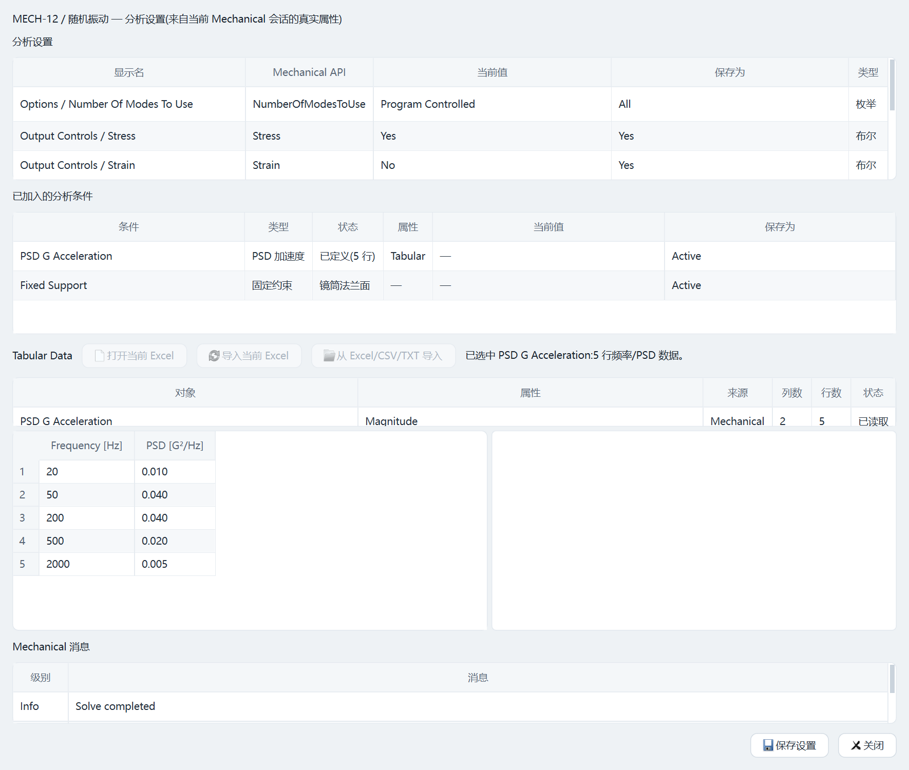
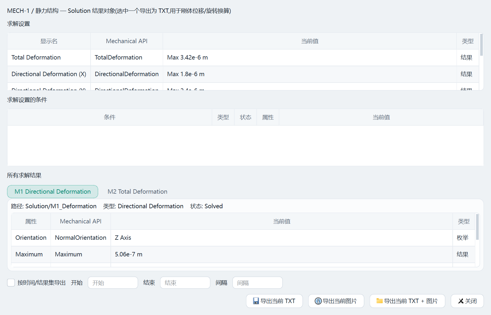
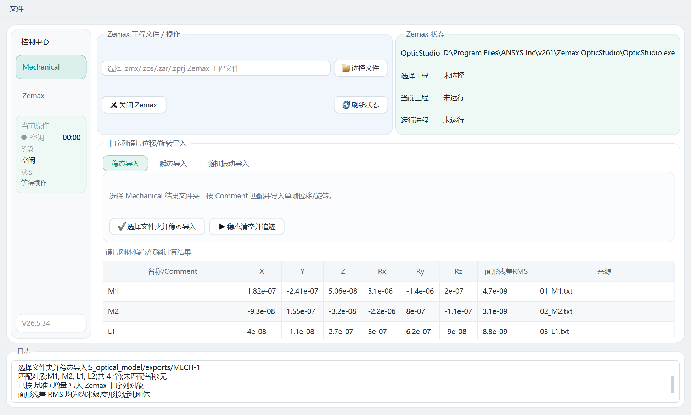
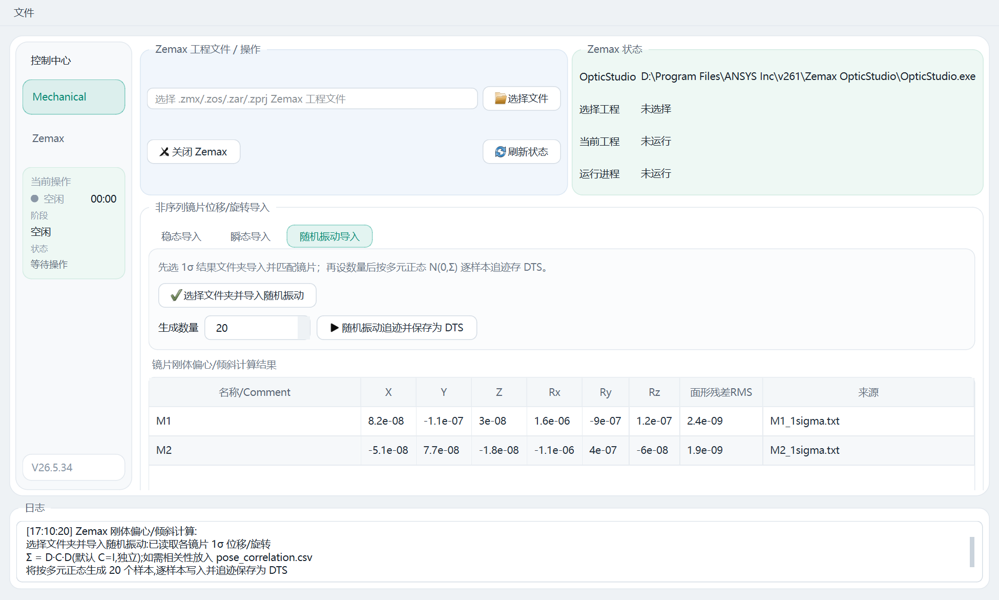
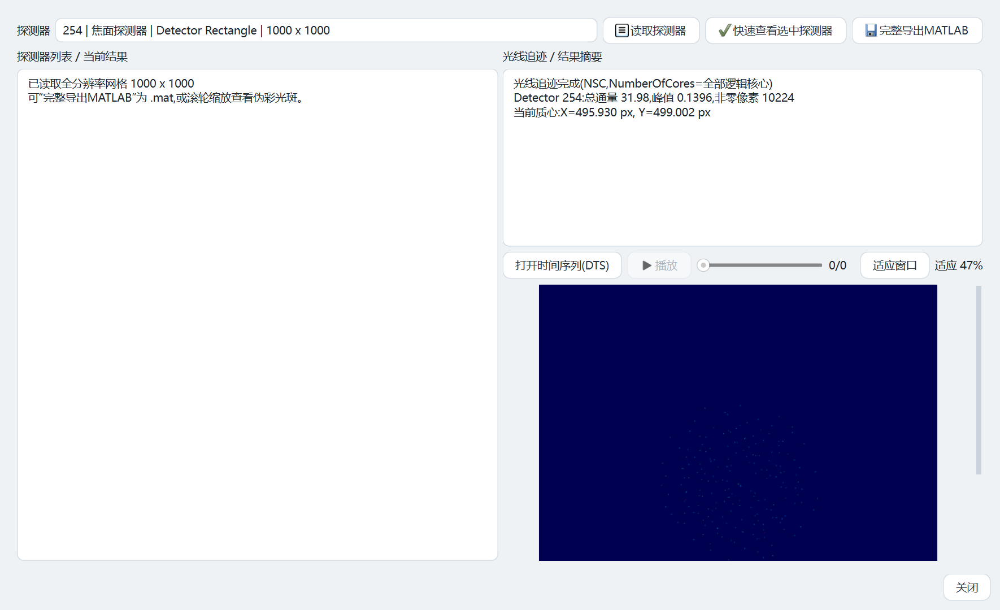

# ansys-mechanical-zemax联合仿真程序 使用说明书

> 面向工程使用者（机械 / 光学工程师）的操作手册。版本 V26.5.34。
> 配套软件为 Ansys Mechanical 与 Zemax OpticStudio 的本机联合仿真（STOP）自动化控制端。

---

## 目录

1. [软件是做什么的](#1-软件是做什么的)
2. [运行前提与安装](#2-运行前提与安装)
3. [主界面与术语](#3-主界面与术语)
4. [十分钟跑通一条稳态联动主线](#4-十分钟跑通一条稳态联动主线)
5. [Mechanical 端操作](#5-mechanical-端操作)
6. [节点位移到镜片刚体位移/旋转](#6-节点位移到镜片刚体位移旋转)
7. [Zemax 端：导入与追迹（两步流程）](#7-zemax-端导入与追迹两步流程)
8. [三种联动模式：稳态 / 瞬态 / 随机振动](#8-三种联动模式稳态--瞬态--随机振动)
9. [探测器窗口与时间序列(DTS)播放](#9-探测器窗口与时间序列dts播放)
10. [命名匹配与基准机制](#10-命名匹配与基准机制)
11. [文件、保存与日志管理](#11-文件保存与日志管理)
12. [常见问题与排查表](#12-常见问题与排查表)
13. [适用范围与已知边界](#13-适用范围与已知边界)

---

## 1. 软件是做什么的

本软件把一条原本要在两套软件、多个脚本、多个文件夹之间反复手工切换的 **结构/热 → 光学（STOP）联合分析** 流程，整合到一个桌面界面里完成：

```
Ansys Mechanical 求解  →  导出镜片节点位移（含原始坐标 X/Y/Z 与位移 UX/UY/UZ）
        ↓  （本软件计算整体平移 + 旋转，SVD/Kabsch 刚体配准）
镜片刚体位移/旋转 ΔP（偏心/离焦）、ΔR（倾斜）
        ↓  （按名称匹配写入，基准 + 增量）
Zemax 非序列工程 → 光线追迹 → 探测器光斑 / 能量 → MATLAB .mat / 伪彩图 / 时间序列(DTS)
```

**它不替代求解器**：有限元解算仍由 Mechanical 完成，光线追迹仍由 Zemax 完成。本软件负责后台启动并保持会话、读写设置、触发求解、读取与导出结果、把节点位移换算成镜片刚体位移/旋转、按名称写入 Zemax、运行追迹、读取探测器数据，并把关键状态显示在统一界面中。

| 软件 | 连接技术 | 是否打开图形界面 |
|------|----------|------------------|
| Ansys Mechanical | PyMechanical（`ansys-mechanical-core`） | 后台会话，不弹 Mechanical 窗口 |
| Zemax OpticStudio | ZOS-API（pythonnet 调用 .NET） | 后台会话，不弹 OpticStudio 窗口 |

当前主流程基于 Mechanical database 文件（`.mechdb` / `.mechdat`）。旧版 Workbench 工程（`.wbpj` / `.wbpz`）脚本仍保留在 `scripts/` 下作为兼容工具，但桌面主流程已转向 database 文件，以减少工程锁与中间文件带来的不稳定。

---

## 2. 运行前提与安装

### 2.1 目标机器必须已具备

- 已安装并授权的 **Ansys Mechanical**（含 PyMechanical 接口）。
- 已安装并授权的 **Zemax OpticStudio**（含 ZOS-API 组件）。
- 安装包**不分发** Ansys、Zemax 及其许可证，必须由用户自行安装授权。

### 2.2 两种使用方式

**方式 A：安装包安装（推荐给最终用户）。** 安装包内置 Python 运行时、PySide6、PyMechanical、pythonnet、numpy、scipy 等依赖，无需单独装 Anaconda。生成的安装程序为 `release\ansys-mechanical-zemax_Setup_V26.5.34.exe`，双击安装到当前用户目录（`%LOCALAPPDATA%\Programs\ansys-mechanical-zemax`，不需管理员），创建开始菜单快捷方式（桌面快捷方式可选）。

**方式 B：从源码运行（开发/调试）。** Python 环境建议 `D:\anaconda\envs\zemax310`（要求 `3.10 ≤ 版本 < 3.12`）：

```powershell
& 'D:\anaconda\envs\zemax310\python.exe' 'D:\260415\ansys_python_control_revised_20260619\scripts\check_environment.py'
& 'D:\anaconda\envs\zemax310\python.exe' 'D:\260415\ansys_python_control_revised_20260619\scripts\run_app.py'
```

`check_environment.py` 会逐项报告 ansys-mechanical-core、PySide6、pythonnet、numpy、scipy 是否就绪以及四个关键可执行文件路径。在 PyCharm 中运行时务必把解释器指向同一个 conda 环境，否则会报 PySide6 / PyMechanical / ZOS-API 找不到。

### 2.3 依赖说明

| 依赖 | 用途 | 缺失影响 |
|------|------|----------|
| PySide6 | 桌面界面 | 软件无法启动 |
| ansys-mechanical-core | PyMechanical 连接 | Mechanical 相关功能不可用 |
| pythonnet | ZOS-API 调用 | Zemax 相关功能不可用 |
| numpy | 刚体配准、多元正态采样 | 旋转拟合回退小角度、随机振动相关性不可用 |
| scipy | 探测器导出 MATLAB `.mat` | 完整导出MATLAB 不可用 |

### 2.4 路径检测与优先级

首次启动会自动扫描常见安装位置（`C:\Program Files\ANSYS Inc\v*`、`D:\Program Files\ANSYS Inc\v*` 及常见 OpticStudio 目录），识别四个关键路径并保存到 `%APPDATA%\WindowsDuan\settings.json`：

| 项 | 默认推断位置（以 v261 为例） |
|----|------------------------------|
| ANSYS 根目录 | `D:\Program Files\ANSYS Inc\v261` |
| `RunWB2.exe` | `…\v261\Framework\bin\Win64\RunWB2.exe` |
| `AnsysWBU.exe`（Mechanical） | `…\v261\aisol\bin\winx64\AnsysWBU.exe` |
| `OpticStudio.exe` | `…\v261\Zemax OpticStudio\OpticStudio.exe` |

优先级为 **环境变量 > 用户配置文件 > 自动检测**。设置了 `ANSYS_ROOT`、`ANSYS_RUNWB2`、`ANSYS_MECHANICAL_EXE`、`ANSYS_OPTICSTUDIO_EXE` 时优先采用。检测不准时，在菜单 `文件 → 路径设置`，或 Mechanical 控制台点「路径设置」，可重新自动检测或逐项手动选择，保存后环境状态自动刷新。


---

## 3. 主界面与术语

软件主界面采用浅色现代主题：白底卡片、细边框、青蓝 Teal 强调色；各功能面板用极淡色调按类别区分（工程/输入类淡蓝、状态/操作类淡青、表格/日志类白）。界面由左侧「控制中心」侧栏、各页主区和底部横跨整宽的日志窗口组成。


**左侧「控制中心」侧栏**：上方在 Mechanical 页与 Zemax 页之间切换，底部集成「当前操作」状态面板。

**「当前操作」面板**用一个状态点直观显示状态，并分行显示阶段/状态/用时：

| 状态点颜色 | 含义 |
|------|------|
| 灰 | 空闲 |
| 青 | 运行中 |
| 绿 | 完成 |
| 红 | 失败 |

| 字段 | 含义 |
|------|------|
| 阶段 | 当前任务属于 读取 / 求解 / 导出 / 关闭 / Zemax 追迹 等 |
| 状态 | 当前模块、求解状态、Mechanical/Zemax 返回信息 |
| 用时 | 从任务开始持续计时，用于判断长任务是否仍在运行 |

**环境状态区**（Mechanical 页顶部）：单行三列显示当前工程、Zemax 工程、RunWB2、Mechanical、OpticStudio、PyMechanical、pythonnet、PySide6 是否可用，路径过长中间省略、悬停看全，点「刷新状态」重新检测。

**底部日志窗口**：记录用户点击、后台任务启动、读取模块数量、求解状态、导出路径、错误信息等，并同时**按天写入磁盘** `%APPDATA%\WindowsDuan\logs\app_YYYYMMDD.log`，关闭软件后仍可追溯；未捕获异常会带完整堆栈写入该日志，便于排查。

**耗时操作均在后台线程执行**（启动、求解、读结果、追迹、导出），界面不卡。同一时刻只允许一个后台操作，未结束时再次点击会提示「当前操作还没有结束」。

**关键术语**

- **模块 / 分析模块**：Mechanical 工程里的一个分析（静力结构、瞬态、随机振动等）。绝大多数操作都以「当前选中模块」为范围。
- **刚体位移/旋转**：镜片/反射镜作为刚体的整体平移（X/Y/Z，单位 m，即偏心/离焦）+ 旋转（Rx/Ry/Rz，单位 deg，即倾斜）。
- **面形残差 RMS**：去除最佳刚体平移+旋转后各节点的剩余位移 RMS，度量镜片偏离纯刚体的程度，**不写入 Zemax**。
- **基准（Baseline）**：Zemax 对象的原始位置。导入采用「基准 + 当前增量」，见 §10。
- **非序列 / NSC**：Zemax Non-Sequential 模式，本软件的追迹与探测器操作都在此模式下。

---

## 4. 十分钟跑通一条稳态联动主线

> 第一次使用，按此顺序即可走完一条「稳态」联动。

1. **启动软件** → Mechanical 页「环境状态」检查 Mechanical / Zemax / PyMechanical / pythonnet / PySide6 / numpy / scipy 是否都「正常」。有「缺失」先去「路径设置」。
2. **选择 Mechanical database**：在 Mechanical 控制台「选择文件」选中 `.mechdb` 或 `.mechdat`，软件在后台启动并保持 Mechanical 会话。
3. **点「读取模块」**：若会话未启动会先启动并保持，再列出「当前工程分析模块」（序号、系统名、模块、系统类型、物理场、分析类型、求解器）。
4. **选中目标模块** → 视需要点「读取设置」改设置并保存 → 点「求解模块」（求解前自动清除该模块旧结果）。
5. **点「读取结果」** → 在结果窗口选中位移类结果 → **「导出当前 TXT」**（务必导出**含节点原始坐标 X/Y/Z + 三方向位移 UX/UY/UZ** 的数据）。导出默认落在 `exports\` 下。
6. **Zemax 页 → 选择 Zemax 工程**（`.zmx`），软件后台加载。
7. **非序列导入区 → 稳态分页 →「选择文件夹并稳态导入」**：指向第 5 步的导出文件夹。软件计算各镜片刚体位移/旋转、按名称匹配写入 Zemax（基准+增量），并显示在「镜片刚体偏心/倾斜计算结果」表中。
8. **「稳态清空并追迹」**：清空非序列探测器旧数据 → 跑一次 NSC 光线追迹。
9. **打开探测器窗口 →「读取探测器」→ 选一个探测器 →「快速查看选中探测器」**（全分辨率伪彩光斑，滚轮可缩放）或 **「完整导出MATLAB」**。
10. **关闭**：分别「关闭 Mechanical」「关闭 Zemax」，各自弹窗选择「保存后关闭」或「不保存关闭」。

---

## 5. Mechanical 端操作

### 5.1 选择、连接与启动会话

选择 `.mechdb` / `.mechdat` 后软件后台启动并保持 Mechanical 会话并记录端口，之后的读设置、求解、读结果、导出都复用这个会话。**会话未成功启动时，后续操作都无法执行**——先看环境状态、日志、路径设置和 Ansys 授权。

「读取模块」会先**启动并保持后台会话**（若尚未启动），再从会话里**真实读取分析对象**（不是从文件名猜测）；读完会话保留。多模块工程（静力、瞬态、随机振动等）必须先在表里选中目标模块再操作，避免把一个模块的设置/结果误用到另一个。

> 注：通过「选择文件」选 database 或直接点「读取模块」都会启动并保持持久会话。早期版本读模块用一次性临时会话、读完即退，导致随后操作提示「未启动后台 Mechanical 会话」，已修正。

### 5.2 读取与修改设置

设置窗口的数据来自**当前会话的真实属性**（`AnalysisSettings.VisibleProperties`），按属性类型（数字/布尔/枚举/文本）生成控件，不是写死模板；同时读取该模块下已加入的分析条件（力、温度、重力、约束、热边界等）。能被 API 读取并允许写入的显示为可编辑，否则作为只读或不显示。

**Tabular Data（频率/时间/幅值表）** 支持读取、「从 Excel/CSV/TXT 导入」、「打开当前 Excel」。推荐把当前表导出成外部 Excel/CSV/TXT，在 Excel 里改好再导入，比软件内逐格编辑更适合几十行以上的数据。

> ⚠️「保存设置」只写回**当前会话**，**不立即写盘** database 文件。是否落盘由关闭 Mechanical 时选择，避免每改一格就触发长时间保存，也给你反悔机会。



### 5.3 求解

- 求解**前自动清除该模块已有结果**，保证读取/导出结果对应当前设置。**旧结果需保留的请先备份。**
- 后台线程执行，「当前操作」面板显示阶段/状态/用时（状态点变青）。
- 软件尝试配置默认求解资源（尽量用更多 CPU 核心），但能否用 GPU、并行到何种程度取决于求解器类型、分析类型与许可证，**最终以 Mechanical 实际执行为准**。
- 求解失败时日志显示 Mechanical 返回的错误（约束不足、接触/材料/网格/载荷问题、结果表达式错误、许可证不足等），状态点变红。**软件不会自动修改物理模型来掩盖错误。**


### 5.4 读取与导出结果

结果窗口以当前模块为范围，列出求解设置、分析条件与 Solution 结果对象，每次选一个结果导出。

| 导出 | 用途 |
|------|------|
| 「导出当前 TXT」 | 位移/形变/力/应力等，供后续刚体位移/旋转换算 |
| 「导出当前图片」 | 结果云图 PNG，供报告 |
| 「按时间/结果集导出」 | 设开始/结束/间隔，按结果可用的时间集或频率集生成序列 |

> 导出前软件尽量评估当前结果，避免导出未刷新对象。若结果表达式非法（例如用户自定义结果里的 `UX` 不是后处理器能识别的名称），Mechanical 会报错并显示出来。
>
> **用于联动的 TXT 必须包含节点原始坐标 X/Y/Z 和三方向位移 UX/UY/UZ**，否则只能算平移、无法拟合旋转（见 §6）。



---

## 6. 节点位移到镜片刚体位移/旋转

Mechanical 给出**节点级位移**，Zemax 非序列对象需要的是元件的**整体刚体位移/旋转**——横向偏心（decenter）、沿光轴离焦（despace）与倾斜（tilt）。软件把某镜片对应的一组节点当作刚体点云做配准：

1. **整体平移**取所有节点位移的（加权）均值（质心位移）：横向分量即偏心、沿光轴分量即离焦。
2. **整体旋转**默认用 **SVD/Kabsch 严格刚体配准**：构造相关矩阵 `H = Σ Pᵢ Qᵢᵀ`（P/Q 为去质心的变形前/后坐标），SVD 后 `R = V·diag(1,1,det(VUᵀ))·Uᵀ`，`det` 项为反射保护以保证 R 为正交旋转（det=+1），再经矩阵对数/轴角映射转为旋转向量 Rx/Ry/Rz（deg）。对任意大小转角都精确；仅在 numpy 不可用或有效节点过少时回退线性化小角度解。
3. **面形残差 RMS**：去除最佳刚体平移+旋转后各节点剩余位移的 RMS，表征该镜片偏离纯刚体的程度。残差与刚体位移同量级时，说明面形畸变显著、单一刚体位移/旋转不足以描述真实变形——此时应考虑面形传递（grid sag / Zernike / STAR，当前版本不含）。

每镜片输出一条记录：`名称、X、Y、Z(m)、Rx、Ry、Rz(deg)、面形残差RMS、节点数、来源文件`，保存为 `lens_pose_latest.csv` / `lens_pose_time_series.csv` / JSON 与计算日志。完整推导见 `docs/节点位移计算整体位移和旋转_理论公式.md`。

**对导出数据的硬性要求**：① Mechanical 坐标系、位移与 Zemax 对象位置同一坐标系；② 单位一致或正确换算（内部按 m/deg 记录，写入时按 Zemax 当前单位换算）；③ 必须三方向位移 + 节点坐标齐全，单方向无法唯一确定三维旋转。

---

## 7. Zemax 端：导入与追迹（两步流程）

Zemax 页用于选择 `.zmx` 工程并做非序列相关操作。当前版本不主动打开 OpticStudio GUI，全程后台 ZOS-API，避免「看到的窗口 ≠ 后台会话对象」的不一致。关闭 Zemax 时可选择保存或不保存后台会话中的修改。


非序列镜片位移/旋转导入分为**稳态、瞬态、随机振动**三个分页。瞬态与随机振动采用**「先导入、后追迹」两步**：

- **第一步（导入）**：点「选择文件夹并导入瞬态 / 随机振动」，选择 Mechanical 结果文件夹，软件计算刚体位移/旋转、按 Comment 匹配镜片并写入 Zemax，同时把结果显示在「镜片刚体偏心/倾斜计算结果」表中。请在此核对「匹配对象」「节点数」「未匹配名称」。
- **第二步（追迹）**：点「瞬态 / 随机振动追迹并保存为 DTS」，**复用第一步选的文件夹**（不再重复弹文件夹框；若未先导入会提示「请先点选择文件夹并导入…」），**点击时弹出探测器选择框**让你直接选用于成像的 Detector，逐帧/逐样本追迹，`.dts` **自动保存**到工程目录下的默认结果文件夹，无需再选保存位置。

稳态分页保留「稳态清空并追迹」做单次快速追迹（不存 DTS）。光线追迹使用 Zemax 工程文件里的默认追迹设置，执行时先清除非序列探测器已有数据再跑一次 NSC 追迹。软件自动检测本机逻辑 CPU 核数并默认把 NSC `NumberOfCores` 设为全部核心；当前不以 GPU 追迹为默认流程。



---

## 8. 三种联动模式：稳态 / 瞬态 / 随机振动

| 模式 | ① 导入按钮 | ② 追迹按钮 | 适用 |
|------|-----------|-----------|------|
| 稳态 | 选择文件夹并稳态导入 | 稳态清空并追迹 | 单一时刻或一组固定变形结果 |
| 瞬态 | 选择文件夹并导入瞬态 | 瞬态追迹并保存为 DTS | 多个时间点逐帧：算位移/旋转→写入→追迹→保存 `.dts` |
| 随机振动 | 选择文件夹并导入随机振动 | 设「生成数量」后点 随机振动追迹并保存为 DTS | 以 1σ 为标准差按多元正态生成样本，逐样本追迹 |

> 对瞬态/时间序列与随机振动，每一帧/每个样本都理解为**相对原始位置的变化**，而不是相对上一帧的增量累加——重复运行不会把位移加两次（见 §10 基准机制）。

**随机振动采样原理**：Mechanical 随机振动（PSD）分析给出各节点 1σ RMS 响应；软件据此算出每镜片 6 个自由度的 1σ 作为标准差，按**多元正态分布 N(0, Σ=D·C·D)** 生成「生成数量」个随机样本（D 为各自由度 1σ 的对角阵，C 为相关矩阵）。

- **默认 C 为单位阵**：各镜片、各自由度独立（与逐项独立高斯等价）。
- **启用相关性**：在导出文件夹放入 `pose_correlation.csv`（6N×6N 数值矩阵，行列顺序见计算日志），软件即用该相关矩阵把镜片间、自由度间相关性（通常来自模态分析）纳入采样；非半正定矩阵会自动投影到最近半正定后再采样。

公式详见理论文档第 9 节。



---

## 9. 探测器窗口与时间序列(DTS)播放

在 Zemax 页点「打开探测器/时间序列(DTS)窗口」弹出探测器窗口：左侧为探测器列表/当前结果，右侧为光线追迹/结果摘要、时间序列(DTS)播放控制与伪彩色预览。



- **「读取探测器」**：先列出探测器，避免一上来就读全部导致久等。
- **「快速查看选中探测器」**：读取**全分辨率**网格并显示伪彩光斑（不落盘数据文件）。伪彩预览可用**鼠标滚轮直接缩放**（向上放大、向下缩小），「适应窗口」一键复位。
- **「完整导出MATLAB」**：把全分辨率矩阵导出为 MATLAB `.mat`，内含矩阵 `detector`（行=Y、列=X 的双精度通量矩阵）与元信息结构体 `detector_info`（探测器编号、注释、像素尺寸、总通量、质心等），在 MATLAB 中 `load` 即可后处理。
- **时间序列 `.dts`**：「打开时间序列(DTS)」后**自动按顺序循环播放**所有帧；也可拖动进度条或用「播放/暂停」逐帧查看。**播放时结果摘要实时显示当前帧的质心坐标**，便于观察随时间/随样本变化的视轴抖动。`.dts` 由瞬态/随机振动追迹自动生成并存于工程目录下的 `zemax_time_series_results` / `zemax_random_vibration_results`。

---

## 10. 命名匹配与基准机制

Mechanical 与 Zemax 的关联**完全依赖名称匹配**：Mechanical 导出的结果文件名（如 `01_M1.txt` 解析出 `M1`）必须与 Zemax 非序列对象的 **`Comment`** 一致（如 Zemax 中某镜片 Comment 为 `M1`）。匹配为全名精确比较（不区分大小写、忽略多余空格），不是子串匹配。**名称不一致 → 软件无法判断该写入哪个镜片 → 该镜片不会被更新。** 导入后请在计算结果表与日志里核对「匹配对象」「节点数」「未匹配名称示例」。

写入 Zemax 的位移/旋转采用「**原始基准值 + 当前 Mechanical 增量**」，不是在上次导入结果上继续累加，因此同一组结果重复导入不会把位移加两次。基准在首次建立时优先取自 `.zmx` 工程的原始位置，保存为 `{工程名}_mechanical_pose_baseline.json` 供之后复用；该规则对时间序列、随机振动同样适用。**需要重置基准时，删除该 JSON 文件即可在下次导入时重建。**

---

## 11. 文件、保存与日志管理

| 类型 | 位置 / 形式 |
|------|-------------|
| Mechanical 结果导出 | `exports\` 下的 TXT / PNG |
| 刚体位移/旋转计算记录 | `lens_pose_latest.csv` / `lens_pose_time_series.csv` / JSON / 计算日志 |
| 探测器导出 | MATLAB `.mat` / 伪彩 PNG |
| 时间序列 / 随机振动追迹 | `.dts`（默认存 `zemax_time_series_results` / `zemax_random_vibration_results`） |
| 软件运行日志 | `%APPDATA%\WindowsDuan\logs\app_YYYYMMDD.log`（按天滚动，关软件后可追溯） |
| 软件本机配置 | `%APPDATA%\WindowsDuan\settings.json`（仅存路径，属当前用户，不随工程分发） |

**「关闭时才落盘」原则**：Mechanical 的设置/表格/载荷修改只写回会话，关闭时弹窗选「保存后关闭」才写入 database，「不保存关闭」放弃本次修改，「取消」不关闭；Zemax 导入位移/旋转后不立即保存 `.zmx`，可先追迹看探测器确认合理再关闭并选择是否保存。软件**不强杀** Ansys 进程、**不绕过** Mechanical 的保存过程，以免造成 database 锁或工程损坏。

---

## 12. 常见问题与排查表

| 现象 | 可能原因 | 处理 |
|------|----------|------|
| 选了文件但读模块/求解/导出都失败 | 后台 Mechanical 未成功启动 | 看环境状态/日志/路径设置/Ansys 授权；确认 `AnsysWBU.exe` 路径正确 |
| 提示「未启动后台 Mechanical 会话」 | 持久会话未建立 | 用「选择文件」选 database 或点「读取模块」启动并保持会话 |
| 环境状态某项「缺失」 | 路径未检测到或依赖缺失 | 「路径设置」重新检测或手动选；源码运行确认 conda 环境 |
| 计算结果只有平移、旋转为 `not_computed` | 导出 TXT 没有节点坐标 | 重新导出**含 X/Y/Z + UX/UY/UZ** 的数据 |
| 某镜片在 Zemax 没变化 | 名称未匹配 | 核对文件名解析出的名 ↔ Zemax 对象 `Comment`（§10） |
| 点追迹提示「请先导入」 | 未先做第一步导入 | 先点「选择文件夹并导入瞬态/随机振动」，再点追迹 |
| 随机振动结果抖动极小 | 系统很稳、响应皮米级 | 属正常；如要测灵敏度可放大 σ 验证 |
| DTS 打开只显示一帧 | 仅一帧 / 旧版无播放控件 | 多帧会自动循环播放；可用进度条/播放按钮 |
| 改了 Tabular Data 重开却没变 | 未在关闭时保存 | 关闭 Mechanical 时选「保存后关闭」 |
| 完整导出MATLAB 报错/不可用 | 缺 scipy | 安装 scipy（`pip install scipy`） |
| 提示「当前操作还没有结束」 | 已有后台任务在跑 | 等当前任务结束，看「用时」判断进度 |

---

## 13. 适用范围与已知边界

**适合**：在 Mechanical 中对镜筒/支架/镜片/反射镜做静力、瞬态或随机振动分析，导出节点位移；软件算每个镜片的整体平移与旋转并写入 Zemax 非序列系统；跑追迹看探测器光斑变化，快速比较不同工况下的光斑偏移、能量分布变化与结构变形对光学系统的影响。

**已知边界**

1. 导入的是**刚体平移+旋转，不含面形误差**；镜片明显翘曲时只导入等效整体位移/旋转，面形需另行扩展传递（grid sag / Zernike / STAR）。
2. 旋转默认采用 **SVD/Kabsch 严格配准**（任意转角精确，含反射保护），仅在 numpy 不可用或有效节点过少时回退小角度近似。
3. 欧拉角分解与旋转顺序相关；软件主输出采用旋转向量（轴角），若需欧拉角须与 Zemax 对象 Tilt 约定一致。
4. 随机振动默认按各自由度/各镜片独立采样；严格情形的镜片间相关性需提供相关矩阵（`pose_correlation.csv`，通常来自模态分析）。
5. 软件是自动化控制端，**最终验证仍以 Ansys Mechanical / Zemax OpticStudio 原软件为准**——任何自动化结果都应结合原模型的单位、材料、边界条件与求解消息确认。

**后续可扩展方向**：面形误差/STAR 接口、多探测器批量导出、随机振动系综平均 PSF 与抖动统计、更完整的属性编辑器、远程 Linux 求解任务管理、自动报告与版本化实验记录。

---

*本说明书对应 `ansys_control` 模块：`gui.py`（界面）、`mechanical.py`（连接/数据库）、`mechanical_ops.py`（操作/导出）、`zemax.py`（位移/旋转计算/ZOS-API 导入/追迹/探测器）、`logging_setup.py`（日志）、`config.py`（路径检测）。功能描述以 V26.5.34 源码为准。*
